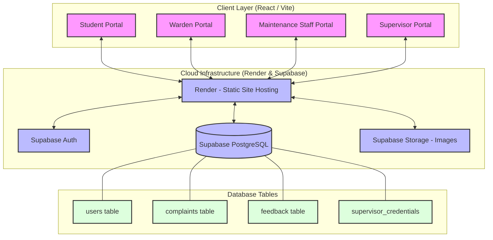

# System Architecture Diagram

This diagram illustrates the high-level architecture of the **Hostel Complaint Management System**, showing the interaction between the frontend portals, the backend service layer, and the persistence layer.

## Component Breakdown

### 1. Client Layer (Vite + React)
*   **Student Portal**: Handles registration, complaint submission, tracking, and feedback.
*   **Warden Portal**: Dashboard for managing complaints, assigning staff, and viewing resident lists.
*   **Staff Portal**: Queue management for assigned tasks and resolution reporting.
*   **Supervisor Portal**: High-level administrative oversight across all hostels.

### 2. Service Layer (Supabase)
*   **Authentication**: Handles secure login for all four roles.
*   **PostgreSQL Database**: Stores all relational data (users, complaints, feedback).
*   **Storage Buckets**: Stores visual evidence (photos) submitted by students and staff.

### 3. Hosting Layer (Render)
*   **Static Site Hosting**: Serves the compiled React application over a global CDN.
*   **Environment Variables**: Securely stores the Supabase API keys (`VITE_SUPABASE_URL`, etc.).
