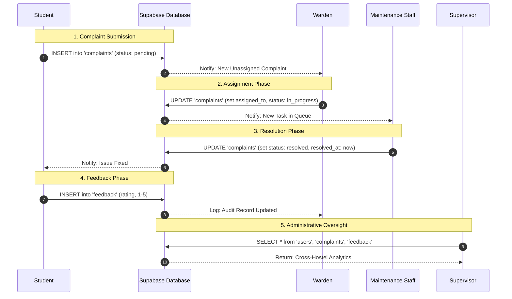

# Data Flow Diagram (DFD)

This diagram visualizes how information moves through the **Hostel Complaint Management System**, specifically focusing on the lifecycle of a grievance.

## Data Lifecycle Summary

| Phase | Table Involved | Actor | Key Actions |
| :--- | :--- | :--- | :--- |
| **Submission** | `complaints` | Student | Uploads description, category, and photos. Sets `severity`. |
| **Assignment** | `complaints` | Warden | Reviews unassigned pool. Maps task to a `specialist`. |
| **Resolution** | `complaints` | Staff | Marks as `resolved`. Uploads completion evidence. |
| **Feedback** | `feedback` | Student | Rates resolution speed and quality (1-5 stars). |
| **Audit** | `users`, `complaints` | Supervisor | Monitors total user counts and system efficiency across hostels. |

## Data Security Layer
*   **Row-Level Security (RLS)**: Ensures students only see their own data, staff only see assigned tasks, and wardens/supervisors have broader administrative visibility.
*   **Encrypted Auth**: Handled by Supabase Auth (JWT), protecting user credentials.
